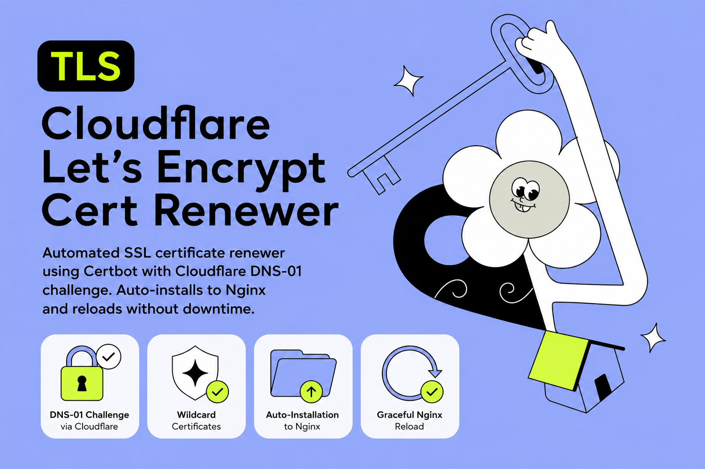

# Cloudflare Let's Encrypt Cert Renewer



*Scroll down for Russian version / Прокрутите вниз для версии на русском языке*

---

An automated SSL certificate renewer container using Certbot with the Cloudflare DNS-01 challenge. When certificates are issued or renewed, the container copies the new certificates to a target directory and restarts/reloads Nginx using the Docker socket.

## Features

- **DNS-01 Challenge**: Automates Let's Encrypt validation via Cloudflare DNS APIs (no need to expose port 80/443 for validation).
- **Wildcard Certificate Support**: Easily request and renew wildcard certificates (`*.domain.com`).
- **Auto-Installation**: Automatically copies certificates to Nginx target directory upon renewal.
- **Graceful Nginx Reload**: Signals Nginx to reload (`HUP` signal) through the Docker socket connection so new certificates are applied without downtime.

## Directory Structure

```
cert-renewer/
├── Dockerfile
├── install-cert.sh
├── renew-cert.sh
└── RUNBOOK_TLS.md
```

## Environment Variables

| Variable | Description | Default / Required |
| --- | --- | --- |
| `CERTBOT_CERT_NAME` | The name of the certbot certificate (often the primary domain). | **Required** |
| `CERTBOT_PRIMARY_DOMAIN` | The primary domain to secure (e.g. `domain.com`). | **Required** |
| `CERTBOT_EXTRA_DOMAINS` | Comma-separated list of additional domains (e.g. `*.domain.com,admin.domain.com`). | **Required** |
| `CLOUDFLARE_API_TOKEN_FILE` | Path to the file containing your Cloudflare API token. | `/run/secrets/cloudflare_api_token` |
| `CERTBOT_RENEW_INTERVAL_SECONDS` | Interval between renewal checks. | `43200` (12 hours) |
| `CERTBOT_PROPAGATION_SECONDS` | Cloudflare DNS record propagation wait time. | `90` |
| `NGINX_CERT_TARGET_DIR` | Directory where certificates will be written for Nginx. | `/out` |
| `NGINX_CONTAINER_NAME` | Name of the Nginx container to reload. | `nginx` |
| `DOCKER_SOCKET_PATH` | Path to the Docker socket inside the container. | `/var/run/docker.sock` |

## Deployment

### Docker Compose Setup

Ensure you mount the Docker socket so the container can reload Nginx:

```yaml
services:
  cert-renewer:
    build:
      context: ./cert-renewer
    container_name: cert-renewer
    environment:
      CERTBOT_CERT_NAME: "yourdomain"
      CERTBOT_PRIMARY_DOMAIN: "yourdomain.com"
      CERTBOT_EXTRA_DOMAINS: "*.yourdomain.com,admin.yourdomain.com"
      NGINX_CONTAINER_NAME: "nginx"
      NGINX_CERT_TARGET_DIR: "/etc/nginx/certs"
      DOCKER_SOCKET_PATH: "/var/run/docker.sock"
    secrets:
      - cloudflare_api_token
    volumes:
      - /var/run/docker.sock:/var/run/docker.sock
      - certs_volume:/etc/letsencrypt
      - nginx_certs_volume:/etc/nginx/certs
    restart: unless-stopped

secrets:
  cloudflare_api_token:
    file: ./secrets/cloudflare_api_token.txt

volumes:
  certs_volume:
  nginx_certs_volume:
```

---

# Автоматическое обновление Let's Encrypt через Cloudflare DNS

Автоматизированный контейнер для выпуска и продления SSL-сертификатов Let's Encrypt с использованием DNS-01 проверки через API Cloudflare. После успешного обновления контейнер копирует новые сертификаты в общую папку и перезапускает Nginx через Docker-сокет без простоя.

## Возможности

- **Проверка DNS-01**: Проходит проверку Let's Encrypt через DNS-записи Cloudflare (не требуется открывать порты 80/443 для проверки).
- **Поддержка Wildcard**: Возможность выпуска сертификатов вида `*.yourdomain.com`.
- **Автоматическая установка**: Копирует обновленные сертификаты в целевую папку Nginx.
- **Перезагрузка Nginx без простоя**: Отправляет сигнал `HUP` в контейнер Nginx через Docker-сокет для применения новых сертификатов без остановки сервиса.

## Структура каталога

```
cert-renewer/
├── Dockerfile
├── install-cert.sh
├── renew-cert.sh
└── RUNBOOK_TLS.md
```

## Переменные окружения

| Переменная | Описание | Значение по умолчанию |
| --- | --- | --- |
| `CERTBOT_CERT_NAME` | Имя сертификата в Certbot (обычно основной домен). | **Обязательно** |
| `CERTBOT_PRIMARY_DOMAIN` | Основной домен для сертификата (например, `domain.com`). | **Обязательно** |
| `CERTBOT_EXTRA_DOMAINS` | Список дополнительных доменов через запятую (например, `*.domain.com,admin.domain.com`). | **Обязательно** |
| `CLOUDFLARE_API_TOKEN_FILE` | Путь к файлу с токеном API Cloudflare. | `/run/secrets/cloudflare_api_token` |
| `CERTBOT_RENEW_INTERVAL_SECONDS` | Частота проверок необходимости обновления. | `43200` (12 часов) |
| `CERTBOT_PROPAGATION_SECONDS` | Ожидание обновления DNS-записей Cloudflare. | `90` |
| `NGINX_CERT_TARGET_DIR` | Папка, куда копируются готовые сертификаты для Nginx. | `/out` |
| `NGINX_CONTAINER_NAME` | Имя контейнера Nginx, который нужно перезагрузить. | `nginx` |
| `DOCKER_SOCKET_PATH` | Путь к сокету Docker внутри контейнера. | `/var/run/docker.sock` |

## Запуск

### Настройка через Docker Compose

Для работы автоперезапуска Nginx необходимо смонтировать Docker-сокет:

```yaml
services:
  cert-renewer:
    build:
      context: ./cert-renewer
    container_name: cert-renewer
    environment:
      CERTBOT_CERT_NAME: "yourdomain"
      CERTBOT_PRIMARY_DOMAIN: "yourdomain.com"
      CERTBOT_EXTRA_DOMAINS: "*.yourdomain.com,admin.yourdomain.com"
      NGINX_CONTAINER_NAME: "nginx"
      NGINX_CERT_TARGET_DIR: "/etc/nginx/certs"
      DOCKER_SOCKET_PATH: "/var/run/docker.sock"
    secrets:
      - cloudflare_api_token
    volumes:
      - /var/run/docker.sock:/var/run/docker.sock
      - certs_volume:/etc/letsencrypt
      - nginx_certs_volume:/etc/nginx/certs
    restart: unless-stopped

secrets:
  cloudflare_api_token:
    file: ./secrets/cloudflare_api_token.txt

volumes:
  certs_volume:
  nginx_certs_volume:
```
