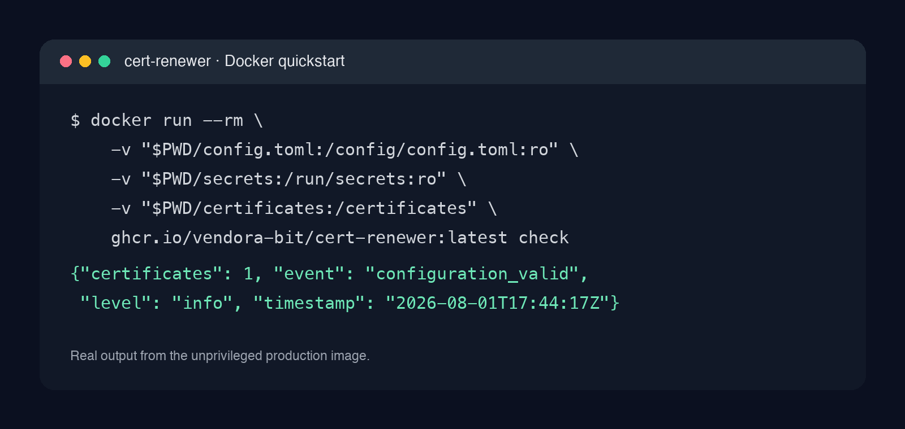

# cert-renewer

> Part of [Vendora Infrastructure](https://github.com/vendora-bit) — small, secure and production-minded tools for databases and self-hosted infrastructure.

[](https://github.com/vendora-bit/cert-renewer/actions/workflows/ci.yml)
[](https://github.com/vendora-bit/cert-renewer/releases)
[](https://github.com/vendora-bit/cert-renewer/pkgs/container/cert-renewer)
[](LICENSE)

**Manage multiple independent Let's Encrypt certificates from one safe Docker
or systemd service.** Cloudflare DNS-01, atomic installation, health checks and
reloads — without mounting the Docker socket by default.



## Why cert-renewer

One server often ends up with a Certbot container per site, cron state scattered
across hosts and a privileged Docker socket just to reload a proxy. cert-renewer
keeps each certificate lineage independent: a failed renewal or reload for one
destination is recorded and retried without blocking the others.

| Capability | cert-renewer | A plain `certbot renew` cron | One Certbot container per service |
| --- | --- | --- | --- |
| Independent certificate lineages | Yes | Usually shared, implicit state | Yes, but duplicated state |
| Reissue when SANs change | Yes | Manual decision | Per-container configuration |
| Atomic cert + key installation | Yes | Deployment script required | Deployment script required |
| Persistent health/status | JSON + `health` | External monitoring required | Per-container monitoring |
| Docker socket required by default | No | Varies | Often yes for reloads |
| systemd deployment | Yes | DIY | DIY |

## Quickstart — validate in two minutes

Create a least-privilege Cloudflare API token with `Zone:DNS:Edit` and
`Zone:Zone:Read` for the required zone. Do not use your Global API Key.

```bash
git clone https://github.com/vendora-bit/cert-renewer.git
cd cert-renewer
cp docker/config.example.toml config.toml
sudo install -d -o 65532 -g 65532 -m 0750 secrets certificates
printf '%s' "$CLOUDFLARE_DNS_API_TOKEN" | sudo tee secrets/cloudflare-example >/dev/null
sudo chown 65532:65532 secrets/cloudflare-example
sudo chmod 0400 secrets/cloudflare-example
```

Edit `config.toml`: set your email, domains and certificate destination. Then
validate the full configuration without issuing anything:

```bash
docker run --rm \
  -v "$PWD/config.toml:/config/config.toml:ro" \
  -v "$PWD/secrets:/run/secrets:ro" \
  -v "$PWD/certificates:/certificates" \
  ghcr.io/vendora-bit/cert-renewer:latest check
```

For a long-running service use the ready-made Compose recipe:

```bash
cp -R examples/docker-compose ./cert-renewer-compose
cd cert-renewer-compose
cp config.toml.example config.toml
sudo install -d -o 65532 -g 65532 -m 0750 secrets
# write a mode-0400, UID/GID-65532 token to secrets/cloudflare-example, then edit config.toml
docker compose up -d
docker compose logs -f cert-renewer
```

`check` only validates; `once` reconciles once; `run` loops; `health` returns
zero only when the last successful cycle is recent enough. Read status from the
configured `state_dir/status.json`.

## Certificate layout and safety

Each issued lineage is installed below its configured `destination`:

```text
/certificates/example.com/
├── current -> revisions/6b1f…
├── fullchain.pem -> current/fullchain.pem
├── privkey.pem -> current/privkey.pem
└── revisions/6b1f…/{fullchain.pem,privkey.pem}
```

The new revision is written and fsynced before `current` is switched. The
compatibility links change only after the key/certificate pair is complete.
Before any write, unsafe symlinks are rejected. Token files must be a regular
single-line file with mode `0600` or stricter; temporary Certbot credentials are
removed after every invocation.

## Recipes

| Deployment | What it demonstrates |
| --- | --- |
| [Nginx](examples/nginx/) | Shared certificate volume and graceful `nginx -s reload` |
| [HAProxy](examples/haproxy/) | PEM bundle assembly from the atomic `current` revision |
| [Mailcow](examples/mailcow/) | A conservative, host-managed certificate hand-off |
| [Proxmox](examples/proxmox/) | Copying to Proxmox paths with ownership and reload safeguards |
| [Kubernetes](examples/kubernetes/) | Read-only certificate consumer; when to use cert-manager instead |
| [Docker Compose](examples/docker-compose/) | Socket-free long-running service |
| [systemd](examples/systemd/) | Dedicated service user and system hardening |

## Why not use X?

**Use Certbot directly** when one hostname and one deployment hook are all you
need. It is the excellent ACME client underneath this project.

**Use cert-manager** when certificates belong inside Kubernetes and should be
represented as Kubernetes resources. This tool deliberately does not replace
that control plane; its Kubernetes recipe is for a self-hosted service that
consumes a certificate generated outside the cluster.

**Use a reverse-proxy-specific ACME integration** when that proxy owns every
domain. cert-renewer is for centralizing independent lineages and destinations
across several services, including services not run as containers.

## Operations

```bash
# one full reconciliation cycle
docker compose -f examples/docker-compose/compose.yaml run --rm cert-renewer once

# liveness/readiness-style probe
docker compose -f examples/docker-compose/compose.yaml exec cert-renewer health
```

The standard Docker deployment is unprivileged, read-only, capability-free and
does not mount Docker's socket. The optional `docker/compose.socket.yaml`
override exists only for trusted single-purpose hosts where a container signal
is truly required; a Docker socket is effectively host-root access.

See [RUNBOOK_TLS.md](RUNBOOK_TLS.md) for failure handling and recovery.

## Roadmap

- [x] Multi-lineage Cloudflare DNS-01 reconciliation and atomic installation
- [x] Docker, Compose, systemd, health/status and local Pebble end-to-end tests
- [ ] Additional DNS providers through reviewed, explicit adapters
- [ ] Prometheus-friendly status exporter
- [ ] More proxy recipes and a configuration migration command

Ideas and small contributions are welcome: see [CONTRIBUTING.md](CONTRIBUTING.md)
and the prepared [good first issues](.github/GOOD_FIRST_ISSUES.md).

## Release and license

The current code version is `2.0.0`; GitHub Releases and GHCR images are
published by pushing a signed `v2.0.0` tag. See [CHANGELOG.md](CHANGELOG.md).

Released under [Apache-2.0](LICENSE). Security reports are handled according to
[SECURITY.md](SECURITY.md).

## Related tools

- [ddns-updater](https://github.com/vendora-bit/ddns-updater) — Cloudflare DDNS Lite for changing A and AAAA records.
- [Cloudflare DDNS + wildcard TLS home-server stack](https://github.com/vendora-bit/ddns-updater/tree/main/examples/home-server-stack) — run DDNS, cert-renewer and Nginx as separate socket-free services.
